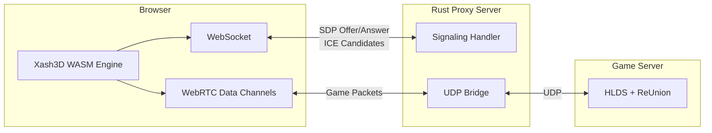
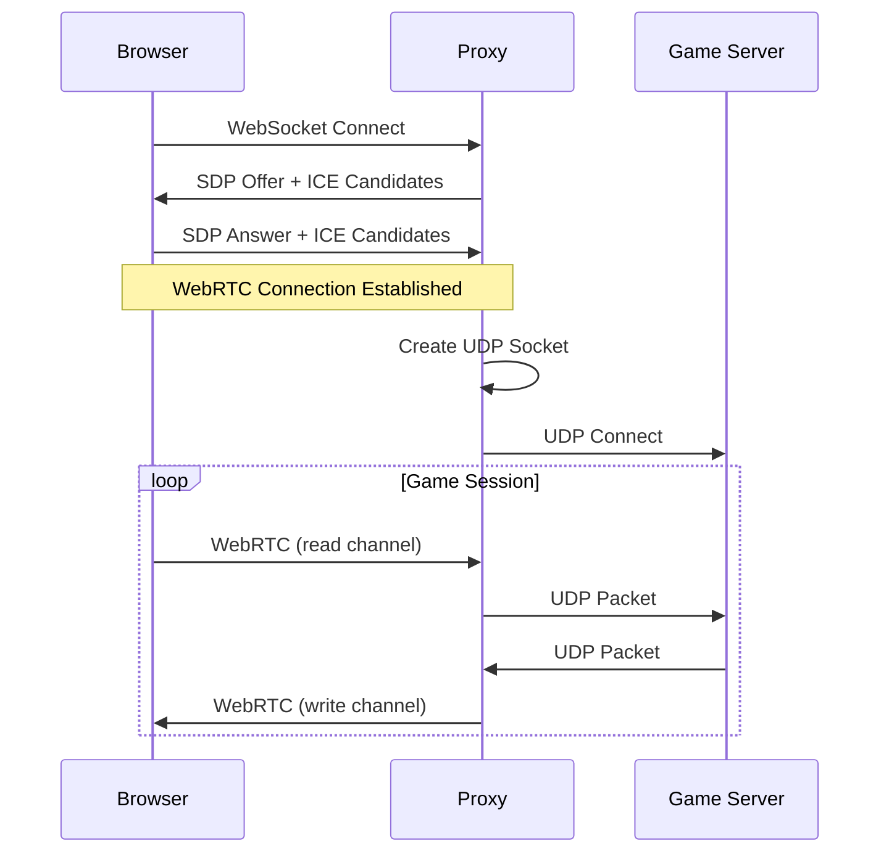
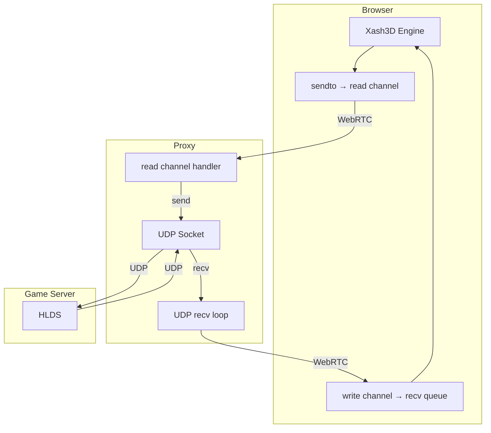
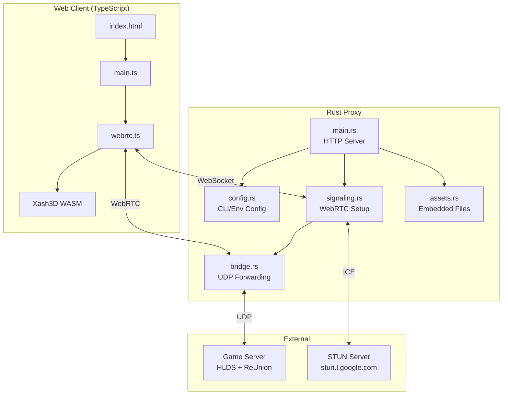

# webxash3d-proxy

A Rust WebRTC-to-UDP proxy that allows browser clients running Xash3D WASM to connect to real CS 1.6 / Half-Life dedicated servers.

## How It Works

The proxy bridges the gap between browser-based WebRTC and traditional UDP game servers:



### Connection Flow



### Data Flow

The proxy uses two WebRTC data channels to match the game engine's expectations:

| Channel | Direction | Purpose |
|---------|-----------|---------|
| `write` | Server → Browser | Game server responses (entity updates, events) |
| `read` | Browser → Server | Player commands (movement, actions) |



## Quick Start

### Option 1: Pre-built Binary (Recommended)

Download the latest release for your platform, then:

```bash
./webxash3d-proxy --server 192.168.1.100:27015 --package-zip ./valve.zip
```

Open `http://localhost:27016` in your browser.

### Option 2: Build from Source

#### Prerequisites

- Rust toolchain
- Node.js and npm
- [cargo-make](https://github.com/sagiegurari/cargo-make): `cargo install cargo-make`

#### 1. Add valve.zip

```bash
# Create from your Half-Life installation:
cd /path/to/Half-Life && zip -r valve.zip valve/
cp valve.zip /path/to/webxash3d-proxy/client/src/
```

#### 2. Build everything

```bash
# Build client + Rust binary (release)
cargo make build-release
```

#### 3. Run

```bash
# Production mode (embedded assets)
./target/release/webxash3d-proxy \
    --server 192.168.1.100:27015 \
    --package-zip ./valve.zip

# Development mode (serve from filesystem)
./target/release/webxash3d-proxy \
    --server 192.168.1.100:27015 \
    --static-dir ./dist
```

### Build Tasks (cargo-make)

| Task | Description |
|------|-------------|
| `cargo make` | Build client + Rust (debug) |
| `cargo make build-release` | Build client + Rust (release) |
| `cargo make dev` | Build client, run proxy with `--static-dir` |
| `cargo make check` | Run fmt, clippy, and tests |
| `cargo make clean` | Clean all build artifacts |

Individual tasks:

| Task | Description |
|------|-------------|
| `cargo make build-client` | Build TypeScript client only |
| `cargo make build-rust` | Build Rust binary only (debug) |
| `cargo make dev-client` | Run Vite dev server |
| `cargo make fmt` | Format Rust code |
| `cargo make clippy` | Run Clippy lints |

## CLI Options

```
Usage: webxash3d-proxy [OPTIONS] --server <SERVER>

Options:
  -s, --server <SERVER>              Game server address (e.g., 192.168.1.100:27015)
  -p, --port <PORT>                  Listen port [default: 27016]
      --host <HOST>                  Bind address [default: 0.0.0.0]
      --public-ip <PUBLIC_IP>        Public IP for ICE candidates (NAT traversal)
  -v, --verbose                      Enable debug logging
      --package-zip <PATH>           Path to valve.zip game assets
      --game-dir <GAME_DIR>          Game directory name [default: cstrike]
      --console-commands <COMMANDS>  Console commands (comma-separated)
```

## Environment Variables

| Variable | Description |
|----------|-------------|
| `GAME_SERVER` | Game server address |
| `LISTEN_PORT` | Listen port (default: 27016) |
| `LISTEN_HOST` | Bind address (default: 0.0.0.0) |
| `PUBLIC_IP` | Public IP for ICE candidates |
| `PACKAGE_ZIP` | Path to valve.zip |
| `GAME_DIR` | Game directory (default: cstrike) |
| `CONSOLE_COMMANDS` | Comma-separated console commands |

## Architecture



## Project Structure

```
webxash3d-proxy/
├── src/                        # Rust proxy server
│   ├── main.rs                 # HTTP server, routes, static files
│   ├── config.rs               # CLI args (clap), env vars
│   ├── signaling.rs            # WebRTC peer connection, data channels
│   ├── bridge.rs               # UDP ↔ WebRTC packet forwarding
│   └── assets.rs               # Embedded static assets (rust-embed)
├── client/                     # Web client (TypeScript/Vite)
│   ├── src/
│   │   ├── index.html          # UI, canvas, login form
│   │   ├── main.ts             # Game initialization, config loading
│   │   ├── webrtc.ts           # WebRTC connection, packet handling
│   │   └── valve.zip           # Half-Life base assets (user provides)
│   ├── package.json
│   └── vite.config.ts
├── .github/workflows/          # CI/CD
│   ├── ci.yml                  # Tests, linting, builds
│   ├── release.yml             # Semantic release
│   └── publish.yml             # GitHub releases
├── dist/                       # Built client output
├── Cargo.toml
├── Makefile.toml               # cargo-make build tasks
└── Dockerfile
```

## Server Requirements

### ReUnion Module

The game server needs **ReUnion** module to accept non-Steam clients (protocol 47/48).

Recommended `reunion.cfg`:
```
EnableQueryLimiter 0
ServerInfoAnswerType 1
FixBuggedQuery 1
```

### Fast Download (Recommended)

For servers with custom content, configure HTTP fast download:

```
// server.cfg
sv_downloadurl "http://your-fastdl-server.com/cstrike/"
sv_allowdownload 1
```

Without this, custom file downloads may timeout in the browser.

## Docker

```bash
docker build -t webxash3d-proxy .

docker run -p 27016:27016 \
    -v /path/to/valve.zip:/app/valve.zip \
    -e GAME_SERVER=192.168.1.100:27015 \
    -e PACKAGE_ZIP=/app/valve.zip \
    webxash3d-proxy
```

## Development

```bash
# Build and run in dev mode (static-dir)
cargo make dev -- --server 127.0.0.1:27015

# Or run client and proxy separately:
cargo make dev-client    # Vite dev server (in one terminal)
cargo run -- --server 127.0.0.1:27015 -v --static-dir ./dist  # Proxy (in another)
```

## NPM Packages

| Package | Description |
|---------|-------------|
| `xash3d-fwgs` | Xash3D engine WASM (xash.wasm, libmenu.wasm, renderers) |
| `cs16-client` | CS 1.6 client WASM (client.wasm, extras.pk3) |

## Troubleshooting

| Issue | Solution |
|-------|----------|
| WebRTC fails | Check firewall, try `--public-ip` flag |
| No server response | Verify server address `ip:port` |
| Instant disconnect | Install ReUnion on game server |
| File download timeout | Configure `sv_downloadurl` on game server |
| "Unsupported Extension Type" | Safe to ignore (WebRTC SCTP extensions) |

## License

MIT
